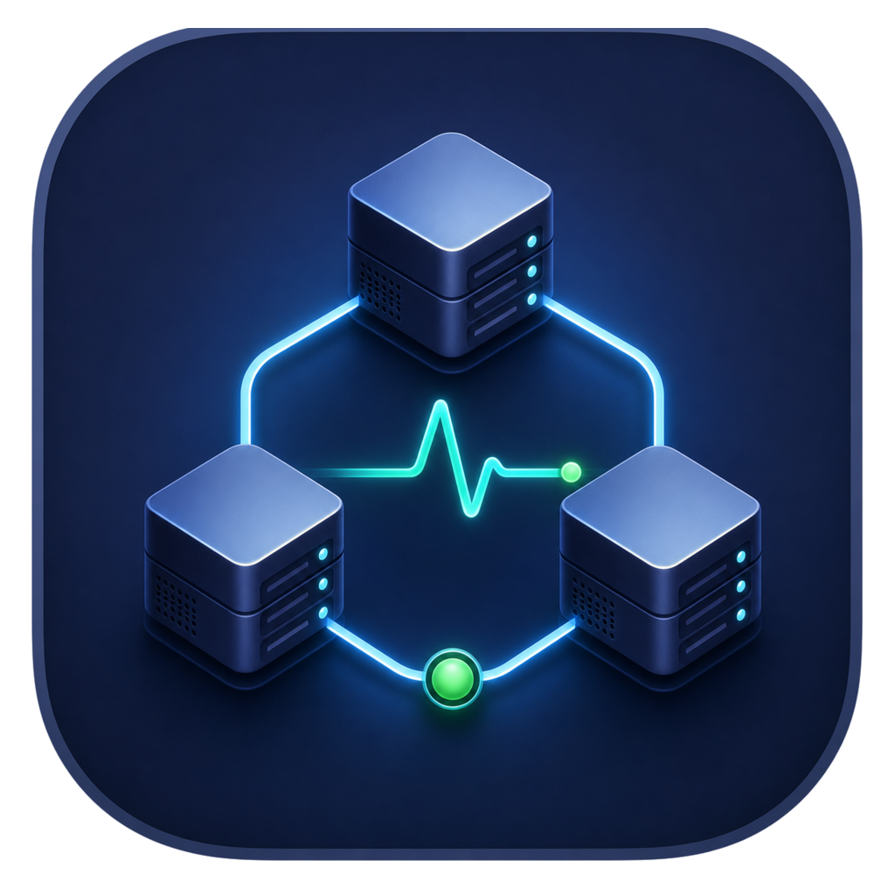

# HPC Task Monitor

HPC Task Monitor is a native macOS application for a clear, manual view of your Slurm jobs over SSH. It is read-only: it does not submit, cancel, alter, poll in the background, or notify about jobs.



## What it shows

- Job ID, name, status, submission/start time, elapsed time, and exit code
- Two sortable views: **Overview** for context and **Scheduler** for Slurm resources
- Scheduler details including priority, partition, QOS, nodes, CPU slots, GPUs, memory, arrays, and node/reason
- Filters for all, running, pending, ended, success, error, and cancelled jobs
- A local metadata table for recording whether a job was submitted by Codex, Claude Code, or yourself, plus its purpose and input/output/script paths

`Success` means Slurm reported `COMPLETED` with exit code `0:0`; it is not a scientific validation of the output.

## Requirements

- macOS 14 or later (Apple silicon or Intel)
- SSH key-based access to a Slurm login node
- `squeue` and `sacct` available on that login node

The application uses the system `ssh` command and can use an alias from `~/.ssh/config`. It never requests or stores an SSH password.

## Install a release build

1. Download the DMG from this repository's Releases page.
2. Drag **HPC Task Monitor** to **Applications**.
3. On first launch, Control-click the app and choose **Open** if macOS warns that the community build is not notarized.
4. Enter your SSH host or alias and Slurm username in **Connection Settings**, then choose **Save & Refresh**.

Leave SSH port and SSH username blank when they are already configured in `~/.ssh/config`.

## Add job context

Slurm does not know a job's scientific purpose or whether it was submitted by an assistant or directly by you. Choose **Open Metadata Table** in the app to edit the local TSV file. The relevant fields are:

| Field | Meaning |
| --- | --- |
| `submitter` | `codex`, `claude`, or `self` |
| `purpose` | A short purpose statement |
| `project` | Project label or directory |
| `input_path`, `output_path`, `script_path` | Locations related to the job |
| `notes` | Any additional context |

Each macOS account stores its settings, metadata, and local snapshot under `~/Library/Application Support/HPC Task Monitor/`. This local data is not packaged in the app or included in this repository.

## Build from source

```bash
zsh scripts/build_app.sh
zsh scripts/build_dmg.sh
```

The first command creates `HPC Task Monitor.app`. The second creates a universal DMG in `dist/`. Builds are ad-hoc signed and are not notarized.

## Privacy and security

The repository intentionally excludes connection settings, SSH configuration, job metadata, job snapshots, logs, and built DMGs. Before publishing a fork or issue, review screenshots and text for cluster addresses, account names, and project paths. SSH commands issued by the app are limited to read-only `squeue`, `sacct`, and `date` queries.

## License and copyright

Copyright © 2026 Yang Yu.

Released under the [MIT License](LICENSE). See [NOTICE](NOTICE) for the project copyright notice.
